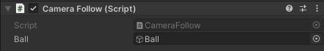

If you want your camera to follow the ball, select the 'Main Camera' GameObject in the Hierarchy window and add the `CameraFollow` script component.

--- collapse ---

---
title: I don't have a CameraFollow script
---

With 'Main Camera' selected, add a new script component called `CameraFollow`. 

Drag the new script file from your Assets into the Scripts folder to organise your files. 

Open the new script in your code editor. Type out or copy and paste the following code: 

--- code ---
---
language: cs
filename: CameraFollow.cs
line_numbers: true
line_number_start: 
line_highlights: 
---

using System.Collections;
using System.Collections.Generic;
using UnityEngine;

public class CameraFollow : MonoBehaviour
{
    public GameObject ball;
    private Vector3 prevBallPos;
    
    void Start()
    {
        prevBallPos = ball.transform.position;
    }

    void LateUpdate()
    {
        transform.Translate(ball.transform.position - prevBallPos, Space.World);
        prevBallPos = ball.transform.position;
    }
}

--- /code ---

Save your script and head back to the Unity editor.

--- /collapse ---

Use the **Inspector** to set the 'Ball' attribute of the `CameraFollow` script.

